# Universidade Estadual de Campinas

# Instituto da Computação

## Disciplina: MC855-2s2021

#### Professor e Assistente

| Nome                     | Email                   |
| ------------------------ | ----------------------- |
| Professora Juliana Borin | jufborin@unicamp.br     |
| Assistente Paulo Kussler | paulo.kussler@gmail.com |

#### Equipe

| Nome                         | RA     | Email                  | ID Git         |
| ---------------------------- | ------ | ---------------------- | -------------- |
| Frederico Meletti Rappa      | 216047 | f216047@dac.unicamp.br | frerappa       |
| João Alberto Moreira Seródio | 218548 | j218548@dac.unicamp.br | SerodioJ       |
| Roberta Rozendo Veronez      | 186671 | r186671@dac.unicamp.br | robertaveronez |
| Willian Takayuki Ozako       | 207267 | w207267@dac.unicamp.br | Oozaku         |

### Descrição do projeto:

O ProjConnect é uma plataforma que permite que pessoas dentro da comunidade da UNICAMP consigam compartilhar ideias de projetos em computação
e que as conecte com pessoas que tenham conhecimento de como desenvolvê-los, criando demanda também para as matérias de projetos.

Este repositório corresponde ao front-end web da plataforma.

#### Telas.

As telas a seguir foram implementadas e já estão funcionando em conjunto com o back end:

* Página inicial do projeto

Contém o botão para realizar o login na plataforma e também apresenta uma descrição curta da plataforma.

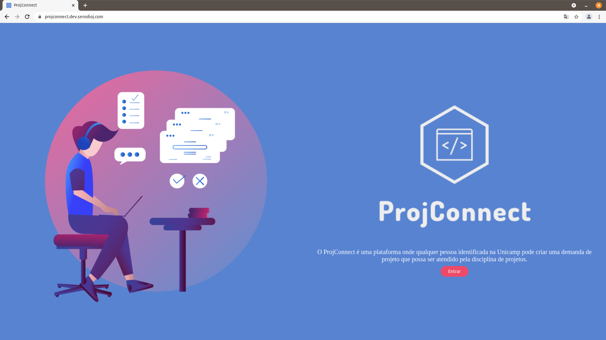

* Página de login

Atualmente disponibilizamos apenas o login com o Google, a API da Google permite apenas usuários da 
Unicamp realizarem o login

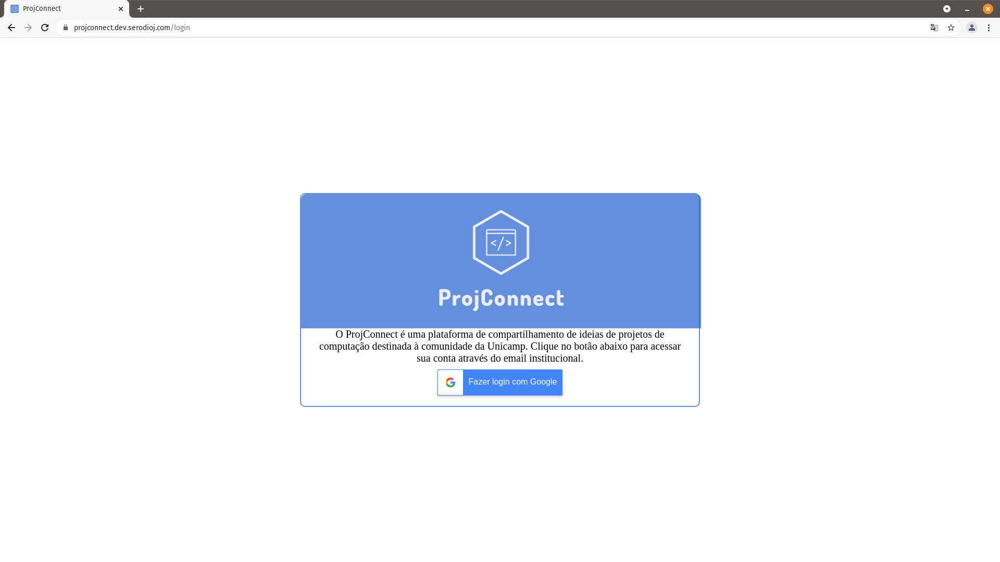

* Lista de Projetos

Lista com todos os projetos da plataforma, ele não filtra por posts ainda abertos ou não, então é sugerível que no futuro se implemente
o filtro de posts ainda em aberto e remover posts que não estão mais ativos.

O botão vermelho no canto superior direito de cada post serve para denunciar o projeto para os moderadores, para evitar o acionamento 
acidental, tem uma janela para confirmar que você quer denunciar o projeto.

Se você clicar no título do projeto, você é redirecionado para a página do projeto com maiores descrições sobre ele.

Os dois botões inferiores servem para pedir para o dono para você participar do projeto e para recomendar um colega para este projeto.


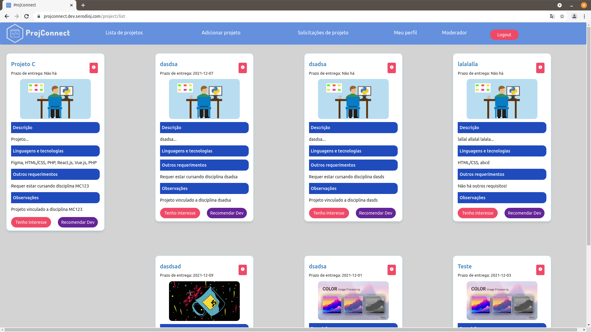


* Página de Projetos

Página com maior mais informações sobre o projeto, como os participantes do projeto (dono da ideia e os desenvolvedores).

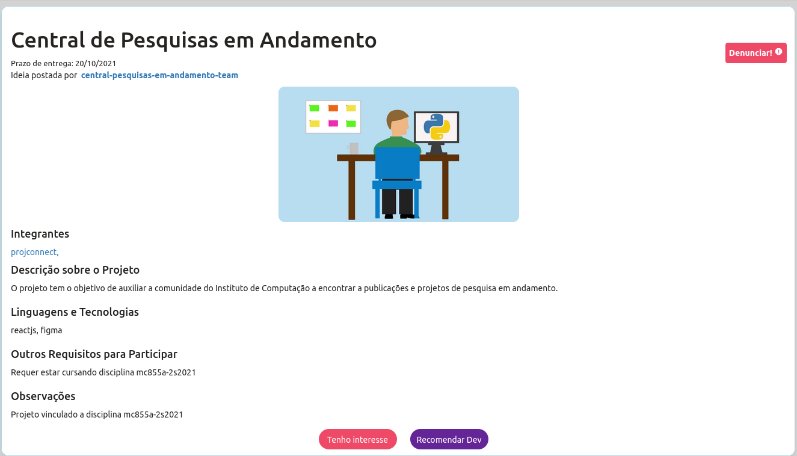

* Recomendar dev

Se você conhece uma pessoa que você acha legal que ela participe de um projeto por, por exemplo, afinidade com o assunto ou 
sobre suas skills, você consegue recomendar essa pessoa para o dono do projeto e escrever o porquê de sua escolha. 

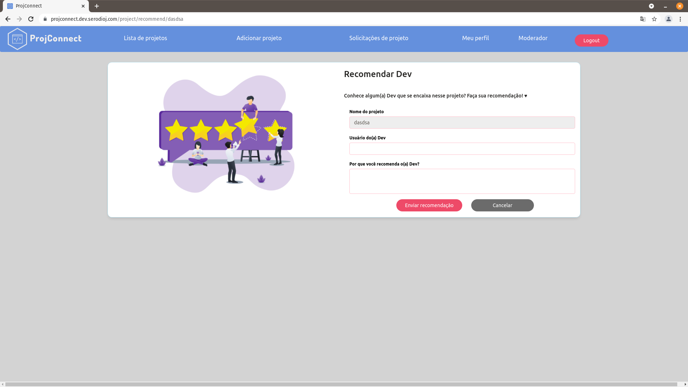

* Página com pedidos de entrada para seu(s) projeto(s)

Essa página serve para que o dono do projeto (aquele que escreveu a ideia) consiga ver se há pessoas interessadas em participar
de seus projetos, ver o perfil clicando no username e aceitar ou recusar o candidato.

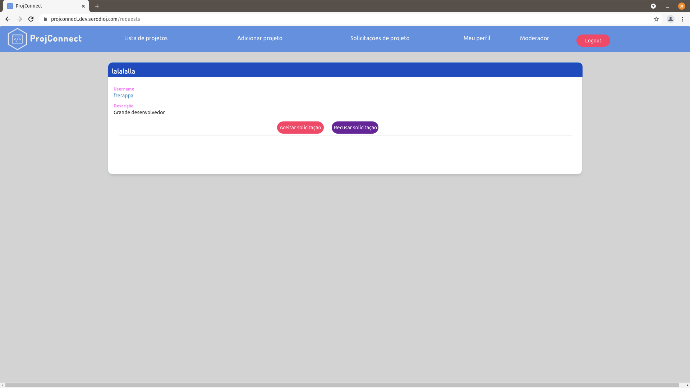

* Meu perfil de usuário

Essa página apresenta suas informações pessoais como seu nome, e-mail, links de github e de gitlab e avatar. Embaixo apresenta
uma linha do tempo com seu histórico de projetos, projetos que você escreveu a ideia e aqueles que você participou como 
desenvolvedor.

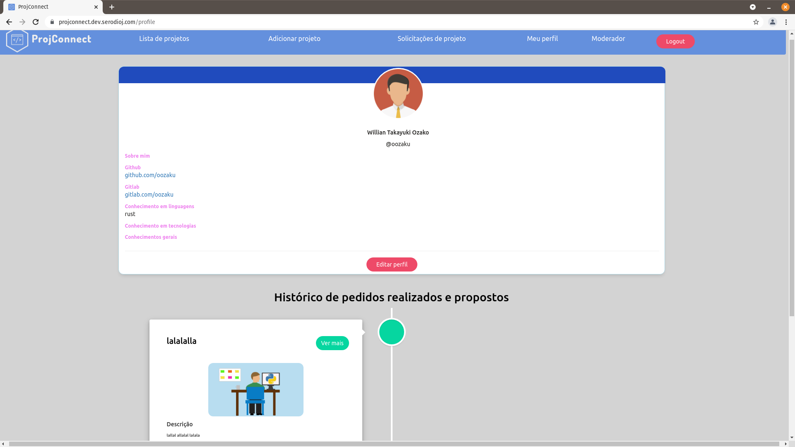

Aqui embaixo destacamos a linha do tempo dos projetos, que também está dentro da mesma página

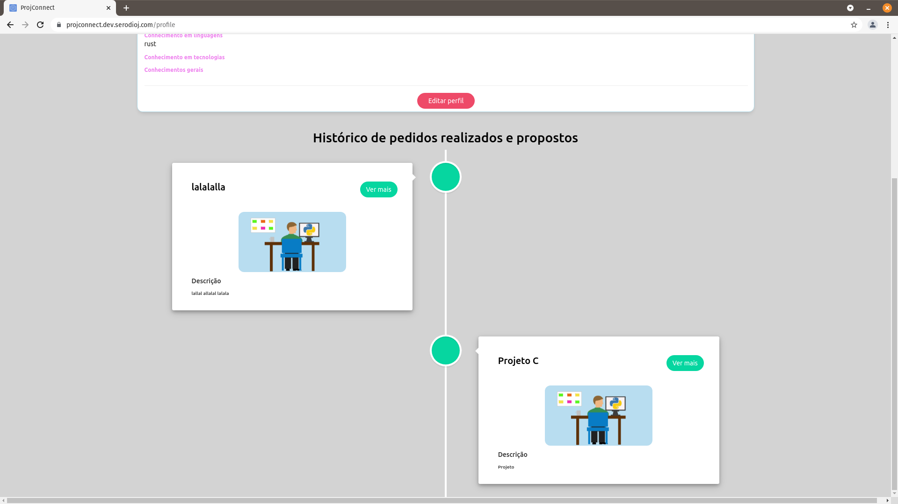

* Editar meu perfil

Editar seus dados pessoais dentro da plataforma e conseguir compartilhar suas ideias, skills e formas de contatos

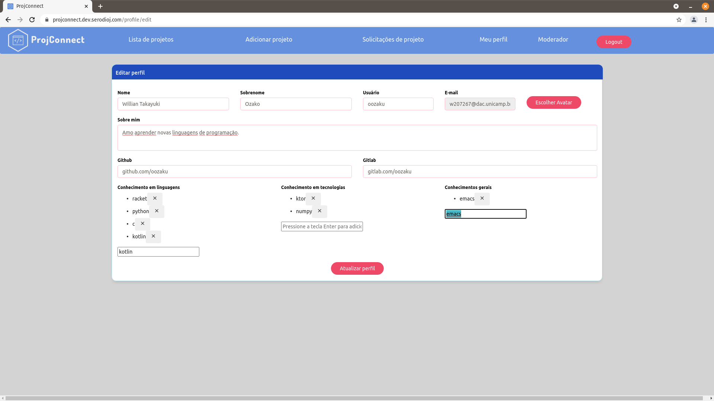

* Tratar denúncias

Aqui está a página que moderadores têm acesso para ver as denúncias de posts e poder remover o post da página de lista de projetos - 
o projeto não é simplesmente deletado, ele é arquivado para futuras punições do autor do post.

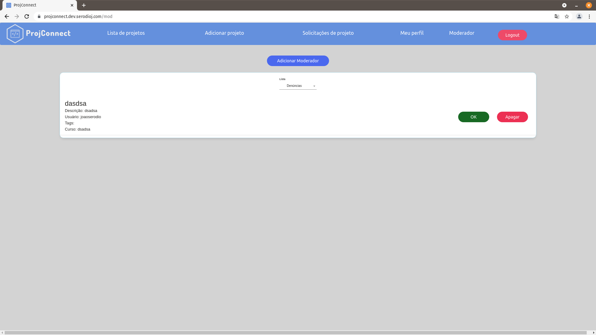


Na mesma página, selecionando usuários, conseguimos ver usuários que tiveram seus posts removidos pelos administradores da plataforma,
ver a quantidade de infrações e também conseguir banir esses usuários.

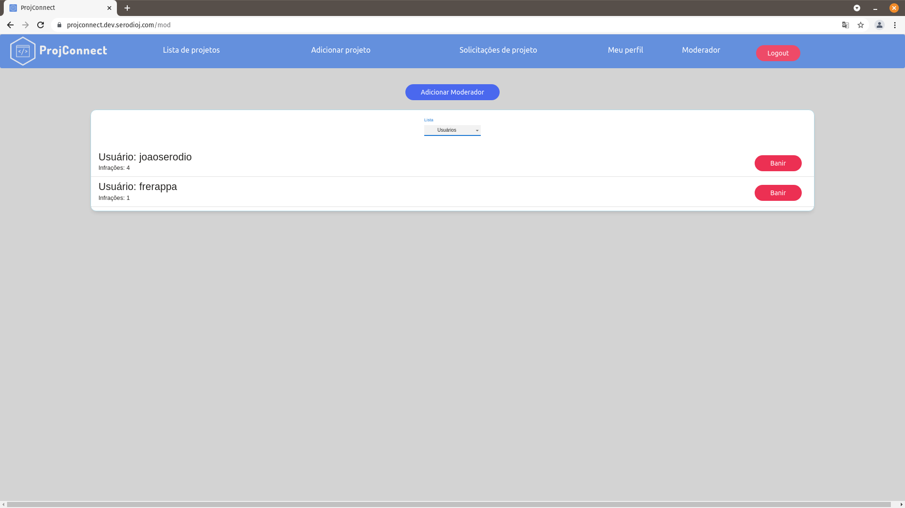


#### Tecnologias e dependências.

O projeto do front-end foi desenvolvido utilizando React.

### Ambientes

#### Configuração do Ambiente (Ubuntu 20.04 foi utilizado)

- Instale os pacotes `g++`, `make` e `python` pelo gerenciador de pacotes.
- Configure o `nvm` para melhor gerenciamento das versões de node na máquina e instale a versão 15 do nodejs
  ```
  curl -o- https://raw.githubusercontent.com/nvm-sh/nvm/v0.38.0/install.sh | bash
  nvm install 15
  ```
- Com a versão 15 do nodejs selecionada, instale o yarn
  ```
  nvm use 15
  npm install --global yarn
  ```
- Na raiz do repositório utilize o yarn para instalar as dependências, a flag `--production` pode ser utilizada para instalar apenas as dependências de produção
  ```
  yarn install
  ```
- Com as dependências instaladas, agora é possível executar o server de desenvolvimento com `yarn start` ou criar o conteúdo estático com `yarn build`.

#### Utilização do pre-commit com ferramentas de lint

O pre-commit está configurado neste repositório, e tem como função verificar questões relacionadas a lint e formatação de arquivos antes de criar um commit.

A fim de configurá-lo na máquina pessoal basta utilizar o `pip` para instalar os pacotes presentes em `requirements_dev.txt`, isso pode ser feito com
`pip install -r requirements_dev.txt` e então basta executar `pre-commit install` no diretório do repositório. No próximo commit os passos do pre-commit serão executados.

### Execução do projeto

#### Desenvolvimento

A fim de executar o projeto do front-end na máquina de desenvolvimento, basta utilizar o script próprio do React, que dará início a um server na porta 3000.
Esse script pode ser executado com

```
yarn start
```

Uma configuração que facilita a execução do front (este repositório) com o back-end é a utilização no NGINX na máquina de maneira que a `/` seja redirecionado para
a porta 3000 e `/api` para a porta da api (usualmente 8080). Com isso, o projeto é acessado na porta 80 (http://localhost).

#### Produção

O NGINX é utilizado como webserver para servir conteúdo estático e proxy para API, e a geração de certificado HTTPS é realizado com o [Certbot](https://certbot.eff.org/)

Um exemplo de arquivo de configuração do NGINX que deve ser adicionado no diretório `sites-available` está presente [aqui](ngnix). O conteúdo estático é gerado executando

```
yarn build
```

Com isso, a pasta build criada, pode ser copiada para `/var/www/<STATIC_CONTENT>` ou um symbolic link pode ser criado

```
sudo ln -s <PATH_TO_BUILD_DIR> /var/www/<STATIC_CONTENT>
```

#### Fabric

Esse repositório contém um fabfile que é utilizado nos workflows de deploy. Assim, utilizando Fabric o pipeline de deploy realiza SSH na máquina e realiza os seguintes passos:

- atualização da branch
- instalação de pacotes
- build de arquivos estáticos

#### Como acessar, quem pode se cadastrar(regras de acessos), etc.

Qualquer pessoa com um email do domínio da UNICAMP (_@unicamp.br, _@dac.unidamp.br) consegue realizar o login utilzando o login integrado com Google.

#### Repositório da Professora Juliana no Gitlab do IC ou Zip com o projeto e todos artefatos para futuras evoluções dos projetos por outros alunos das turmas seguintes
